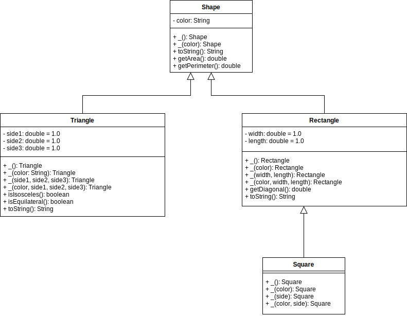
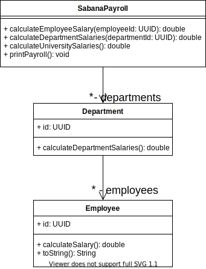

# LAB-INHERITANCE

## Parte I - Entendiendo herencia

* Lea atentamente las clases `Circle` y `Shape`.
* Para la clase `Circle`, defina `PI` como una propiedad constante, esto implica que tenga modificadores `final` y `static`.
* Para la clase `Circle`, sobreescriba el método `getArea` de tal forma que todas las pruebas de la clase `CircleTest` para ese método pasen. Agrege pruebas adicionales.
* Para la clase `Circle`, sobreescriba el método `getPerimeter` de tal forma que todas las pruebas de la clase `CircleTest` para ese método pasen. Agrege pruebas adicionales.
* Para la clase `Circle`, implemente el método `getArea` de tal forma que todas las pruebas de la clase `CircleTest` para ese método pasen. Agrege pruebas adicionales.
* Para la clase `Circle`, sobreescriba el método `toString` de tal forma que todas las pruebas de la clase `CircleTest` para ese método pasen, debe usar la implementación de la superclase `Shape`. Agrege pruebas adicionales.
* Tome una captura de pantalla como evidencia de las pruebas que logro ejecutar de forma exitosa.

## Parte II - Implementando herencia

* Revise con atención el diagrama de clases de esta sección.
* En el archivo de SOLUTION.md cargue las imagenes de sus diseños y evidencia de ejecución de pruebas.



### Clase `Triangle`

* Construya la clase `Triangle`, asegurese que herede de `Shape`.
* Implemente cada uno de los constructores propuestos en el diseño para la clase `Triangle`. Debe usar los constructores heredados de la clase `Shape` cuando corresponda y asignar los valores por defecto para las propiedades.
* Construya la clase de pruebas `TriangleTest`.
* Dentro de la clase `TriangleTest` construya pruebas para los métodos `getArea`, `getPerimeter`, `isIsoceles`, `isEquilateral` y `toString`. Aegurese de hacer pruebas para triangulos instanciados con todos los constructores anteriormente definidos.
* Implemente el código necesario en la clase `Triangle` para que las pruebas pasen.

### Clase `Rectangle`

* Construya la clase `Rectangle`, asegurese que herede de `Shape`.
* Implemente cada uno de los constructores propuestos en el diseño para la clase `Rectangle`. Debe usar los constructores heredados de la clase `Shape` cuando corresponda y asignar los valores por defecto para las propiedades.
* Construya la clase de pruebas `RectangleTest`.
* Dentro de la clase `RectangleTest` construya pruebas para los métodos `getArea`, `getPerimeter`, `getDiagonal`, y `toString`. Aegurese de hacer pruebas para rectangulos instanciados con todos los constructores anteriormente definidos.
* Implemente el código necesario en la clase `Rectangle` para que las pruebas pasen.
 
 ### Clase `Square`
 
 * Construya la clase `Square`, asegurese que herede de `Rectangle`.
 * Implemente cada uno de los constructores propuestos en el diseño para la clase `Square`. Debe usar los constructores heredados de la clase `Rectangle` cuando corresponda y asignar los valores por defecto para las propiedades.
 * Construya la clase de pruebas `SquareTest`.
 * Dentro de la clase `RectangleTest` construya pruebas para los métodos `getArea`, `getPerimeter`, `getDiagonal`, y `toString`. Aegurese de hacer pruebas para cuadrados instanciados con todos los constructores anteriormente definidos.
 * NO debe sobreescribir ningún método, con la implementación de la clase `Rectangle` todas sus pruebas deberían ejecutarse satisfactoriamente.
 
 ## Parte III - Diseñando Herencia
 
 * Realmente no esta bien que tengamos los métodos `isIsosceles` y `isEquilateral`, proponga un diseño por medio del cuál usted define clases para abstraer el concepto de estos dos tipos de triangulos; diseñe en UML las propiedades, métodos y relaciones de herencia de estas nuevas clases.
 * NO modifique el código, solo exponga la propuesta del nuevo diseño.
 * En el archivo de SOLUTION.md cargue las imagenes de sus diseños.
 
 ## Parte IV - Herencia en un contexto
 
 Lea el siguiente caso de negocio:
 
 La Universidad de la Sabana que tiene múltiples empleados y departamentos necesita que usted diseñe el sistema de nomina llamado `SabanaPayroll`, para ello la empresa le ha dado la siguiente información:
 * Los departamentos cuentan con un identificador único y nombre.
 * Todos los empleados cuentan con nombre, apellido, identificador único y departamento para el que trabajan.
 * La empresa cuenta con 3 tipos de empleados, los que reciben el pago por salario fijo, los que reciben el pago por comisión y los que reciben el pago por horas.
    * Por horas: El salario se calcula usando una constante fija del valor de la hora y se multiplica por el total de horas trabajadas.
    * Por salario: El salario fijo mensual menos las prestaciones sociales, el 4% de salud y 4% de pensión. Debe poder consultarse cuál es el valor del descuento de las prestaciones. 
    * Por comisión: El salario se calcula usando una constante fija del valor de la comisión y se multiplica por el total de productos vendidos.
 * El sistema debería permitir:
    * Calcular el salario para cualquier empleado.
    * Calcular el salario de todos los empleados de un departamento.
    * Calcular el salario de toda la Universidad.
    * Imprimir en pantalla la lista de empeados de la siguiente forma
    
```
Juan Perez, departamento FINANZAS, salaraio $23424.4, pago por horas 
Jorge Gómez, departamento VENTAS, salaraio $23424.4, pago por salario
Laura Beltran, departamento INGENIERÍA, salaraio $23424.4, pago por comisión
```
 
 1. Use el diagrama de clases inicial para terminar de diseñar el sistema completo, incluya todo lo que considere necesario, atributos, métodos, relaciones.
 2. Diseñe el diagrama de secuencia para los métodos `printPayroll`, `calculateEmployeeSalary`, `calculateDepartmentSalaries`, y `calculateUniversitySalaries`.
 3. Cree la clase `SabanaNominaTest` y cree diversas pruebas para los métodos anteriormente mencionados.
 4. Implemente los métodos y asegurese que las pruebas están bien diseñadas y se ejecutan de manera correcta.
 5. En el archivo de SOLUTION.md cargue las imagenes de sus diseños y evidencia de ejecución de pruebas.
 
  
 
 ## Condiciones
 
 * Todos los editables de los diagramas de este laboratorio se encuentran en la carpeta `diagrams`.
 * Cree un repositorio llamado APELLIDO1-APELLIDO2-APELLIDO3-SABANA-POOB-2021-1-LAB-INHERITANCE en GitHub y suba a llí la solución del laboratiorio.
 * Cree un archivo SOLUTION.md donde deberá documentar toda la solución del laboratorio. NO MODIFIQUE EL README.md.
